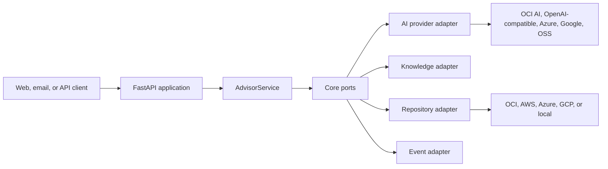
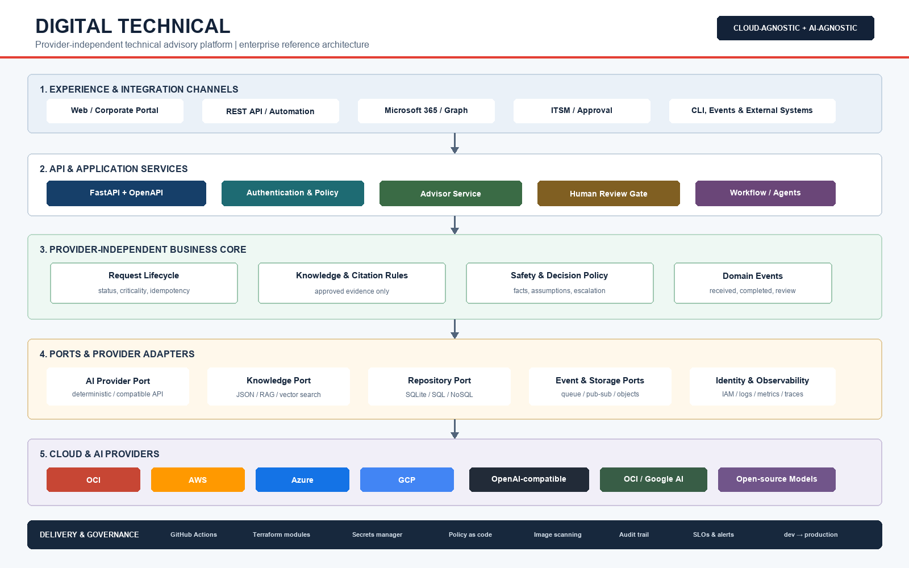

# DIGITAL TECHNICAL

DIGITAL TECHNICAL is a modular technical advisory platform designed to keep its
business rules independent from cloud and AI vendors. It exposes a FastAPI API,
retrieves approved knowledge, applies safety gates, generates a recommendation,
persists the result, and emits domain events.

## Status

- Provider-independent Python core: implemented
- REST API and OpenAPI: implemented
- Local SQLite, JSON knowledge, local storage, and logging adapters: implemented
- Deterministic and OpenAI-compatible AI adapters: implemented
- OCI Terraform module: implemented and validated with Terraform 1.5.7
- Osaka functional environment: deployed and health-validated
- AWS, Azure, and GCP capability mappings: documented for future provider modules
- Outlook/Graph, production RAG, executable OCI Function image, and enterprise IdP: pending

## Architecture



See [docs/architecture/overview.md](docs/architecture/overview.md) and the
editable diagrams under [diagrams](diagrams).



## Requirements

- Python 3.11 or newer
- `make` and a POSIX shell for helper commands
- Docker 24+ for container execution, optional
- Terraform 1.5+ and OCI provider 7-8 for OCI deployment
- An OCI account and least-privilege policies only when deploying OCI resources

## Local installation

```bash
git clone <repository-url>
cd digital-technical
./scripts/bootstrap.sh
make validate
./scripts/run_local.sh
```

Open `http://localhost:8080/docs` for OpenAPI or check health:

```bash
curl http://localhost:8080/health
```

The API contract and error behavior are documented in
[docs/development/api.md](docs/development/api.md).

Submit a request:

```bash
curl -X POST http://localhost:8080/v1/requests \
  -H 'Content-Type: application/json' \
  -d '{"question":"How should a cloud change be validated?","criticality":"medium"}'
```

## Configuration

Copy `.env.example` to `.env`. Never commit `.env`.

| Variable | Purpose | Default |
| --- | --- | --- |
| `DT_ENVIRONMENT` | Runtime environment | `dev` |
| `DT_DATABASE_URL` | Repository adapter URL | local SQLite |
| `DT_AI_PROVIDER` | `deterministic` or `openai-compatible` | `deterministic` |
| `DT_AI_BASE_URL` | OpenAI-compatible API base | OpenAI API |
| `DT_AI_MODEL` | Provider model/deployment name | placeholder |
| `DT_AI_API_KEY` | AI provider secret | empty |
| `DT_REQUIRE_API_KEY` | Require `x-api-key` | `false` |
| `DT_API_KEY` | Local API key | empty |
| `DT_KNOWLEDGE_FILE` | Approved knowledge JSON | example file |
| `DT_CLOUD_PROVIDER` | Observability/provider label | `local` |

Use a cloud secret manager in deployed environments. Do not place secrets in
Terraform variables, source files, container images, or CI configuration.

## AI provider replacement

`AdvisorService` depends on the `AIProvider` protocol. Select
`DT_AI_PROVIDER=deterministic` for offline tests or `openai-compatible` for a
compatible chat-completions endpoint. New providers implement `generate()` and
are registered in `app/api/main.py`; the service and domain models remain unchanged.

## OCI deployment

```bash
cd infrastructure/terraform/stacks/oci
cp ../../environments/dev/terraform.tfvars.example terraform.tfvars
# Replace placeholders without committing terraform.tfvars.
terraform init
terraform validate
terraform plan
terraform apply
```

The validated Osaka test endpoint is recorded in the implementation report, not
hard-coded as an application dependency. Full instructions are in
[docs/deployment/oci.md](docs/deployment/oci.md).

## Other clouds

The core and container are portable. Implement a provider stack satisfying the
capability contract for compute, API gateway, database, object storage,
messaging, observability, and identity. See
[docs/deployment/multicloud.md](docs/deployment/multicloud.md).

## Quality and security

```bash
make validate
```

Validation runs linting, formatting checks, automated tests with coverage, and a
repository secret scan. CI repeats these checks for every pull request.
Security assumptions and the production hardening checklist are documented in
[docs/operations/security.md](docs/operations/security.md).
The latest reproducible evidence is in
[docs/operations/validation-report.md](docs/operations/validation-report.md).

## Repository map

```text
app/                         business, application, adapters, and API
providers/                   provider capability registry
infrastructure/terraform/    reusable modules, stacks, and environments
tests/                       unit, adapter, API, and workflow tests
docs/                        architecture, deployment, operations, development
diagrams/                    editable Mermaid and rendered architecture
scripts/                     bootstrap, run, validation, secret scan
examples/                    non-sensitive sample knowledge
```

## Known limitations

The OCI Functions Application currently has no executable function image, and
the public OCI deployment exposes a health route only. The Python API is fully
functional locally. Production RAG, mailbox ingestion, enterprise identity,
async workers, provider-native persistence adapters, and live Generative AI
credentials remain explicit future work.

## License

This repository is currently distributed under the proprietary terms in
[LICENSE.md](LICENSE.md). Replace them only after organizational approval.
